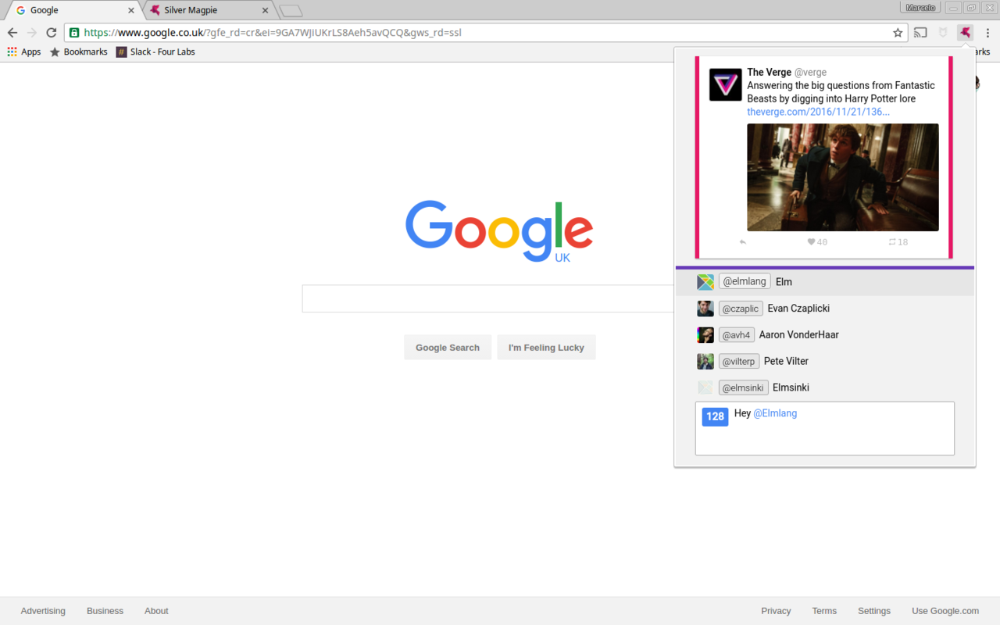

# Silver Magpie 

>The cleanest Twitter client for Chrome

Silver Magpie is a beautiful Chrome extension written entirely in [Elm](elm-lang.org).

[Add it to Google Chrome](https://chrome.google.com/webstore/detail/silver-magpie/fodacnnlggakjhanpmjacokgpngeeabi)

Logo by [Jozef Krajcovic](http://jozefkrajcovic.sk/)

## The future

The idea is to make the application fully controllable only using the keyboard. Going through the timeline, tweeting, retweeting, changing accounts, everything seemless, fast and without the need for a mouse.
This will allow for a brand new and fun way to interact with Twitter.

## Changelog

### v0.0.0.4

- Reply to tweets
- See quoted tweets

### v0.0.0.5

- Open extension with `Ctrl+Shift+1` for max-speed retweeting
- Detach app window for always-connected tweeting
- Tweet times with link to Twitter
- Usage hints in footer

### v0.0.0.6

- Fix double spaces in tweet bar

### v0.0.0.7

- Allow navigating the timeline with arrow keys
